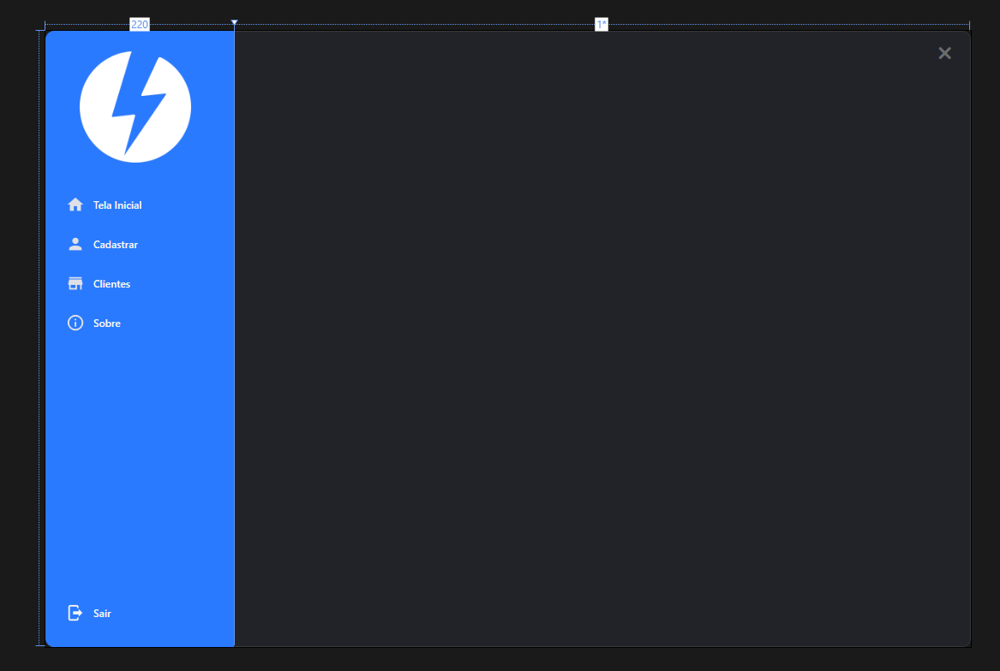
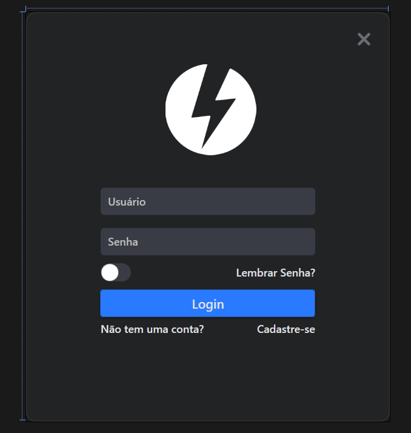
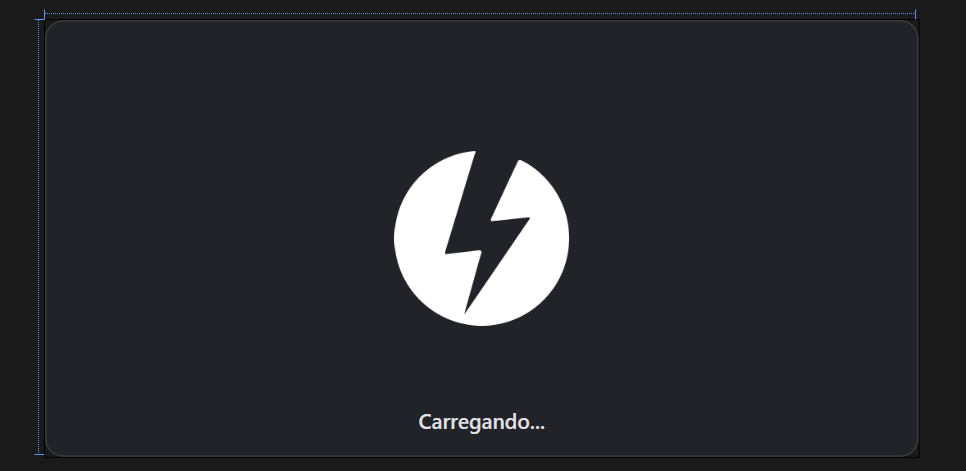

# PROJECT CODEV
Sistema desktop para gestão de assistência técnica, desenvolvido com C# e .NET, utilizando arquitetura com API REST e banco de dados PostgreSQL.

O projeto tem como objetivo organizar clientes, aparelhos e ordens de serviço, permitindo registrar e acompanhar reparos de forma simples e centralizada.

---

# Interface

## UI_Dashboard

  

## UI_Login

  

## UI_Splash

  
</

---

# Tecnologias utilizadas

## Backend

- C#
- ASP.NET Core Web API
- Entity Framework Core
- PostgreSQL

## Frontend Desktop

- WPF
- XAML
- HandyControl

## Ferramentas

- Visual Studio
- Git
- REST API

---

# Arquitetura do sistema

## O sistema utiliza uma arquitetura em três camadas:

WPF Desktop (Interface)
        ↓
ASP.NET REST API
        ↓
PostgreSQL Database

## Essa separação permite:

- melhor organização do código
- segurança no acesso ao banco
- possibilidade de múltiplos clientes no futuro (web, mobile, etc.)

---

## Funcionalidades atuais

- Tela de login com autenticação
- Conexão com API REST
- Verificação de status da API (Health Check)
- Registro de clientes
- Registro de aparelhos
- Cadastro de defeitos relatados
- Sistema de logout
- Opção de lembrar usuário e senha

---

## Funcionalidades planejadas

- Listagem de clientes
- Sistema de ordens de serviço
- Busca e filtros
- Histórico de reparos
- Status do aparelho (em análise, em reparo, concluído)
- Painel administrativo

---

## Estrutura do projeto

Codev
│
├── Codev_V2
│   └── Aplicação WPF (interface desktop)
│
├── API_Codev
│   └── ASP.NET Core Web API
│
└── Database
    └── PostgreSQL

---

## Como executar o projeto

- Clonar o repositório

  git clone https://github.com/seuusuario/codev.git

- Abrir no Visual Studio

  Abrir a Solution (.sln).

- Configurar banco de dados

  Editar a connection string no projeto da API.

  appsettings.json

  Exemplo:

  Host=localhost;
  Port=5432;
  Database=codev;
  Username=postgres;
  Password=sua_senha;

- Executar migrations

  No console do gerenciador de pacotes:

  Update-Database

- Executar a aplicação

- Iniciar a API
- Executar o projeto WPF

---

# Objetivo do projeto

## Este projeto está sendo desenvolvido para estudo de:

- desenvolvimento desktop com WPF/WinUI3/MAUI
- criação de API REST com ASP.NET
- integração com PostgreSQL
- arquitetura de aplicações em múltiplas camadas

---

by: Adrian Oliveira
